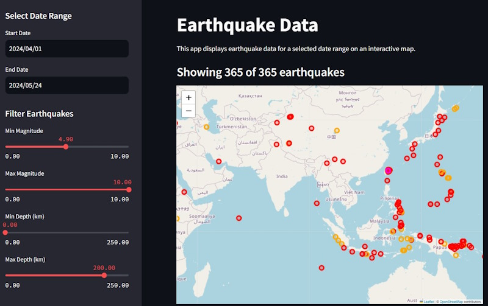

# Predicción de eventos sismicos usando Modelos de Machine Learning y Visualización de Datos

Esta aplicación de Streamlit muestra datos de eventos sismicos para un rango de fechas seleccionado en un mapa interactivo y utiliza modelos de aprendizaje automático para la predicción de eventos sismicos. Los datos se obtienen del USGS Earthquake Catalog API y se pueden filtrar por magnitud y profundidad.



## Características

- Seleccionar un rango de fechas para ver los datos de eventos sismicos
- Filtrar eventos sismicos por magnitud mínima y máxima
- Filtrar eventos sismicos por profundidad mínima y máxima
- Mapa interactivo que muestra las ubicaciones de los eventos sismicos con marcadores codificados por colores según la magnitud
- Tabla de datos que muestra detalles de los eventos sismicos filtrados
- Modelos de aprendizaje automático para la predicción de eventos sismicos
- Exploración de datos en tiempo real con visualizaciones interactivas

## Instalación

Para ejecutar esta aplicación, necesitas tener Python instalado. Sigue los pasos a continuación para configurar y ejecutar la aplicación:

1. Clona el repositorio:
    ```bash
    git clone https://github.com/Maria-Alejandra-Echeverri/Geofisica.git
    ```

2. Instala los paquetes necesarios:
    ```bash
    pip install -r requirements.txt
    ```

## Ejecutar la Aplicación

Asegúrate de estar en el directorio del proyecto y que el entorno virtual esté activado.

Ejecuta la aplicación de Streamlit:
```bash
streamlit run earthquakemap_streamlit/streamlit_app.py
```
Al ejecutar esto, se abre tu navegador en el path http://localhost:8501 para ver la aplicación.


## Uso

### Seleccionar rango de fechas

Utilice los selectores de fechas en la barra lateral para seleccionar las fechas de inicio y finalización de los datos del eventos sismicos que desea ver.

### Filtrar eventos sismicos

Utilice los controles deslizantes de la barra lateral para establecer la magnitud y profundidad mínima y máxima de los eventos sismicos. El mapa y la tabla de datos se actualizarán automáticamente para reflejar los datos filtrados.

### Mapa interactivo

El mapa muestra las ubicaciones de los eventos sismicos con marcadores codificados por colores según la magnitud:

- Plata: Magnitud < 1,8
- Amarillo: 1,8 ≤ Magnitud < 2,4
- Naranja: 2,4 ≤ Magnitud < 5
- Rojo: 5 ≤ Magnitud < 7
- Magenta: 7 ≤ Magnitud < 8,5
- Púrpura: Magnitud ≥ 8,5

Haga clic en un marcador para ver detalles sobre el eventos sismicos, incluida la magnitud y la ubicación.

### Tabla de datos

Debajo del mapa, una tabla de datos muestra información detallada sobre los eventos sismicos filtrados, incluido el lugar, la magnitud, el tiempo, la longitud, la latitud y la profundidad.

## Dependencias

- streamlit
- pandas
- requests
- folium
- streamlit-folium

Asegúrese de que estos paquetes aparezcan en el archivo `requirements.txt` para una fácil instalación.

## Licencia

Este proyecto está bajo la licencia MIT. Consulte el archivo `LICENCIA` para obtener más detalles.